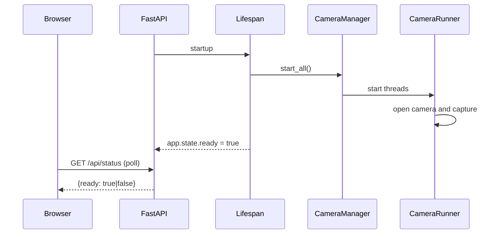
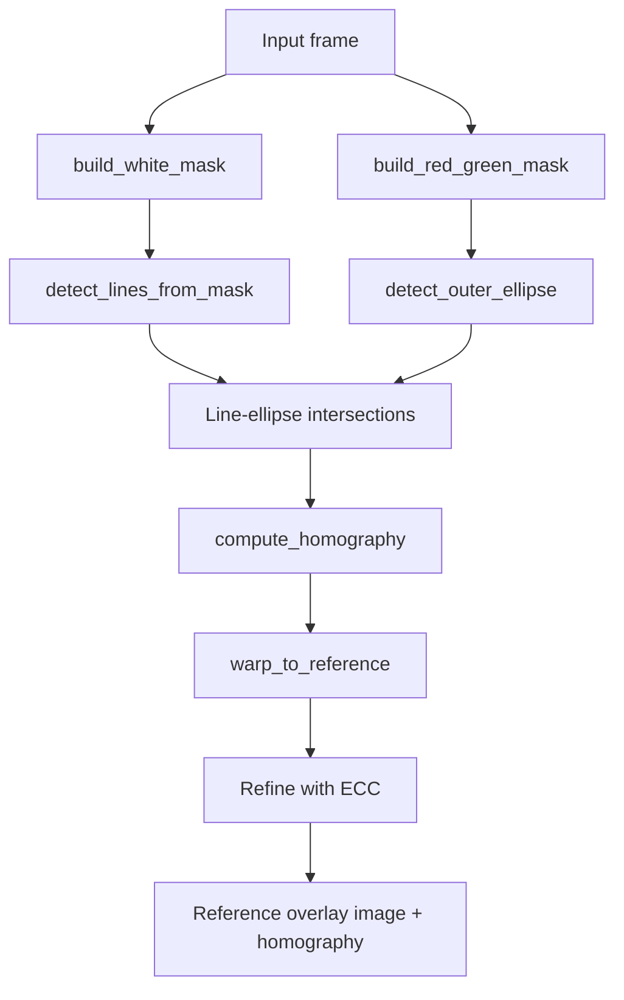
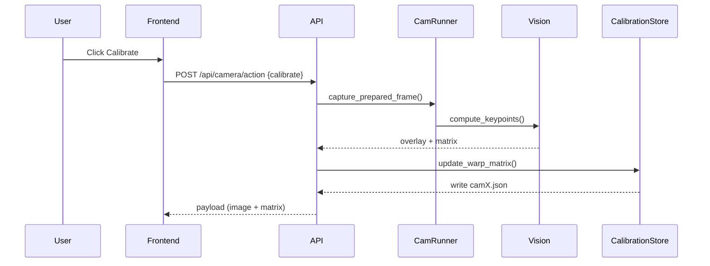
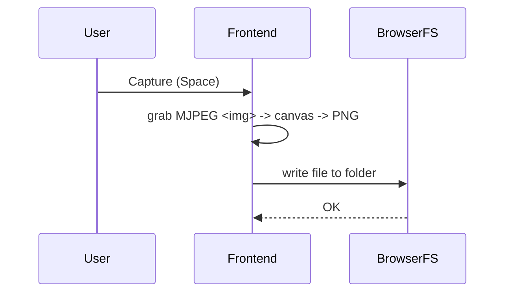

# AI Dart Scorer - Project Guide

This guide explains how the system starts, how data flows through it, and where to make changes. It is meant to help new maintainers understand, debug, and refactor quickly.

## Purpose
The project is a local FastAPI app that:
- Serves a web UI.
- Streams MJPEG camera feeds.
- Calibrates each camera to a canonical dartboard reference.
- Provides a data collection mode that saves aligned frames for training.

## Repository Map
```
backend/
  main.py                 FastAPI app and static mount.
  api.py                  API routes and camera actions.
  core/lifespan.py         Startup/shutdown and camera init.
  vision/
    cameras.py             Camera threads + frame preparation.
    calibration_store.py   Calibration JSON I/O and runtime cache.
    keypoint_detection.py  High-level calibration pipeline.
    line_detection.py      White line detection (Hough).
    ellipse_detection.py   Outer ellipse detection (red/green mask).
    homography.py          Homography + ECC refinement.
    reference.py           Dartboard geometry and overlay.
    reference.png          Reference image for ECC.
    calibration_data/*.json Saved per-camera calibration data.
frontend/
  index.html               Home page (mode selection).
  settings.html            Settings and camera calibration UI.
  game.html                Game parameters page.
  game-modes/data-collection.html  Data collection mode.
  assets/js/*.js           Frontend behavior.
  assets/css/*.css         UI styling.
```

## High-Level Architecture
```mermaid
flowchart LR
  Browser -->|HTTP| FastAPI
  FastAPI -->|Static UI| Frontend
  FastAPI -->|/api/stream/{cam}| CameraManager
  FastAPI -->|/api/camera/*| CameraManager
  CameraManager --> CameraRunner
  CameraRunner -->|OpenCV capture| Cameras
  CameraRunner --> CalibrationRuntime
  CalibrationRuntime -->|read/write| calibration_data
  FastAPI --> VisionPipeline
  VisionPipeline --> reference.png
```

## Where Things Start
1. `uvicorn backend.main:app` loads `backend/main.py`.
2. `FastAPI(lifespan=lifespan)` in `backend/main.py` wires the startup/shutdown lifecycle.
3. The `lifespan` context in `backend/core/lifespan.py` starts the camera manager and waits for cameras to open.
4. The frontend is served from `frontend/` as static files (mounted at `/`).

## Startup and Readiness Flow


Notes:
- The UI polls `/api/status` every 500ms. It shows the "Warming up" screen until `ready` is true.
- The backend sets `ready = true` after the camera init loop, even if some cameras are missing (after timeout).

## Backend Entry Points
**App**: `backend/main.py`
1. `FastAPI(lifespan=lifespan)` initializes app and lifecycle.
2. `app.include_router(api_router)` registers API routes from `backend/api.py`.
3. `app.mount("/", StaticFiles(...))` serves the UI.

**Lifecycle**: `backend/core/lifespan.py`
- `_init_cameras()` creates `CameraManager` with camera indices and capture settings.
- `CameraManager.start_all()` starts capture threads and a sync clock.
- `app.state.ready` is toggled based on readiness and shutdown.

## Camera Pipeline
Camera capture and streaming are handled by `backend/vision/cameras.py`.

Key concepts:
- `CameraManager` owns multiple `CameraRunner` objects.
- Each `CameraRunner` runs in a thread, grabs frames from OpenCV, prepares them, and emits JPEGs for MJPEG streaming.
- A `SyncClock` keeps JPEG streams aligned between cameras (shared tick at `jpeg_fps`).

**Frame preparation** in `CameraRunner._prepare_frame()`:
1. Undistort using `CalibrationRuntime` (if calibration is present).
2. Center-crop to square.
3. Resize to `720 x 720` (`_output_size`).
4. Apply warp (homography) if present.

## API Surface
File: `backend/api.py`

**Status**
- `GET /api/status` -> `{"ready": bool}`

**UI routes**
- `GET /` serves the frontend.
- `GET /settings` returns `frontend/settings.html`.
- `GET /game` returns `frontend/game.html`.
- `GET /game/data-collection` returns data collection mode.

**Streaming**
- `GET /api/stream/{cam_id}` returns a multipart MJPEG stream.
- Uses `CameraManager.wait_for_jpeg()` to block until a new frame is ready.

**Camera actions**
- `POST /api/camera/action` with payload `{cam_id, action}`. Valid `action` values are `rotate_left`, `rotate_right`, `calibrate`, and `reset`. These rotate the stored homography, run auto calibration, or clear the homography.
- `POST /api/camera/manual-warp` with `{cam_id, points}` updates the homography from a manual quad.

**Debug**
- `POST /keypoints` (debug only) returns overlay + matrix for an uploaded image.
- `frontend/settings.html` includes a debug section for this endpoint.

## Vision and Calibration Pipeline
The calibration pipeline runs in `backend/vision/keypoint_detection.py`.



Key modules:
- `ellipse_detection.py`: Finds the outer board ellipse using red/green mask in HSV.
- `line_detection.py`: Detects white lines using Canny + Hough.
- `homography.py`: Uses line/ellipse intersections to align the camera view to the canonical board.
- `reference.py`: Defines dartboard geometry and overlay drawing.

ECC refinement:
- `homography._refine_with_ecc()` aligns edges of the warped image to `reference.png` to improve the matrix.

## Calibration Storage and Runtime
Calibration files live in `backend/vision/calibration_data/*.json`.

Schema (example):
```json
{
  "camera_id": "cam1",
  "image_size": {"width": 860, "height": 640},
  "undistort": {
    "camera_matrix": null,
    "dist_coeffs": null
  },
  "warp": {
    "matrix": [[1,0,0],[0,1,0],[0,0,1]]
  }
}
```

Runtime behavior:
- `CalibrationRuntime` watches the file modification time and reloads when the file changes.
- `undistort()` uses fisheye maps if `camera_matrix` and `dist_coeffs` are present.
- `warp()` applies the 3x3 homography if present.

## Calibration Flows
### Auto Calibrate


### Manual Warp
1. User drags the quad overlay in the settings modal.
2. Frontend posts `{points}` normalized to the image width/height.
3. Backend builds a perspective transform and updates the calibration file.

### Rotate
- `ROTATE_STEP_DEG = 18.0` in `backend/api.py`.
- Rotation is applied to the stored warp matrix via `rotate_warp_matrix()`.

## Frontend Overview
Key files:
- `frontend/index.html` + `assets/js/app.js`: home, game mode selection, startup polling.
- `frontend/settings.html` + `assets/js/settings.js`: camera preview, calibration modal, debug tools.
- `frontend/game.html` + `assets/js/game.js`: simple page showing game parameters.
- `frontend/game-modes/data-collection.html` + `assets/js/data-collection.js`: data capture UI.

## Data Collection Mode


Details:
- Uses the File System Access API (Chrome/Edge).
- Stores directory handles in IndexedDB (`assets/js/fs-handles.js`).
- File naming pattern: `00001_cam1.png`, `00001_cam2.png`, `00001_cam3.png`.

## Configuration and Extension Points
**Camera indices and capture size**:
- Edit `backend/core/lifespan.py` where `CameraConfig` is defined.

**Stream framerate and quality**:
- Update `CameraConfig` in `backend/vision/cameras.py`.

**Vision thresholds**:
- `backend/vision/line_detection.py`: Canny/Hough parameters.
- `backend/vision/ellipse_detection.py`: HSV thresholds, morphology, area limits.

**Reference geometry**:
- `backend/vision/reference.py` defines ring radii and the canonical layout.

## Notes and TODOs
- `backend/vision/calibration.py` is not wired into the current flow (placeholder).
- The `/keypoints` API and debug section in settings are marked TEMP and should be removed before release.
- There is no auth on any endpoint. This is intended for local/LAN use only.

## Troubleshooting
**UI stuck on "Warming up"**
- Check `/api/status` response.
- If some cameras are missing, the backend logs a warning after ~50s but still sets ready = true.

**Camera preview is black or not live**
- Confirm `CameraConfig.index` values match system camera indices.
- Check that the camera is not in use by another app.

**Calibration fails or overlay missing**
- Ensure board is fully visible and well lit.
- Check red/green mask thresholds in `ellipse_detection.py` and white mask thresholds in `line_detection.py`.

## Suggested Next Steps for Maintainers
1. Remove TEMP debug endpoints and UI before production.
2. Add scoring logic and hit detection (currently not implemented).
3. Add automated tests for homography and calibration updates.
